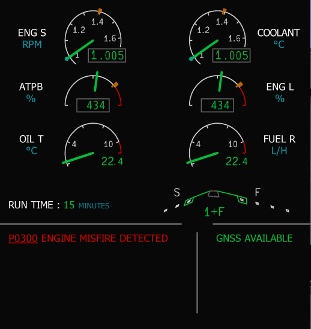
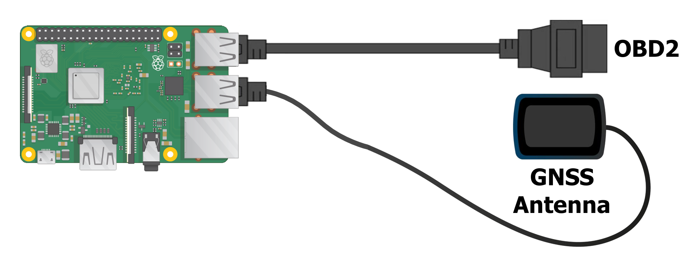

# ECCM

The **Electronic Centralized Car Monitoring** (**ECCM**) is an open source
system capable of logging every available engine data using an OBD2 
connection with the ECU of the car. The ECCM is also capable of monitoring
the position of the car by using a GNSS (GPS, Glonass, Galileo or Beidou)
which can be logged alongside the engine data. The logged data can then be
sent to a S3 server for further data archiving/processing. The ECCM system
can host a socket server in order to communicate with the ECCM in order to 
get engine data and clear diagnostic codes.

## FEATURES INCLUDED

- Get engine diagnostic codes 
- Engine data and position logged into a file
- Send automatically the engine logs files to a S3 server
- Host a socket server in order to interact with the ECCM

## SETUP

The ECCM is a Python 3 software which can be loaded into a computer plugged to the car via the OBD2 port
using a bluetooth OBD2 adapter or a USB wired OBD2 adapter and a GNSS antenna 
in order to have the geoposition tracking. The ECCM was tested on a Raspberry
Pi 3B+ using this wiring with USB devices :

### Prerequisites

- Install Python3 with pip on the host computer
- Assign a static usb port for the GNSS antenna and the OBD2 adapter ([tutorial for raspberry pi](https://www.freva.com/assign-fixed-usb-port-names-to-your-raspberry-pi/))

### Configuration file

The configuration of the ECCM is done via the [config.ini.template](config.ini.template) 
file which needs to be changed to **config.ini** in order to be used by the ECCM

Here are the configuration parameters:

| Parameter         | Usage     | 
|--------------|-----------|
| CAR_IDENTIFIER | Identifier of the car (use a unique identifier for you server, license plate for example)     | 
| FILE_RECORDING | Set to yes if you want to activate the file recording, comment or put no if you want to disable  | 
| GPS_POSITION_MONITORING | Set to yes if you want to activate the gps position monitoring | 
| OBD_INTERFACE | Name of interface used by the obd package to connect to the car (comment or remove to use the auto selection mode) | 
| MONITORING_FILE_EXTENSION | File extension used for monitoring files | 
| MONITORING_FILE_SEPARATION_CHARACTER | Character used to separate values (by default: ',' if extension is .csv; '\t' if extension is .tsv and '|' if other extension) | 
| RECORD_DIRECTORY_LOCATION | Location of the directory where all recordings are saved | 
| S3_SERVER_ENDPOINT | Location of the S3 server used to send files to | 
| S3_SERVER_AK | Access key of the S3 server used to send files to | 
| S3_SERVER_SK | Secret key of the S3 server used to send files to | 
| S3_SERVER_BUCKET | Bucket name used to send files to | 
| S3_SERVER_REGION | Region of the S3 server used to send files to | 
| ENABLE_SOCKET_SERVER | Set to yes if you want to activate the socket server interface | 
| SOCKET_SERVER_PORT | Port used by the socket server if activated | 
| SOCKET_SERVER_SECRET | Secret used by the socket server (if activated) to authenticate the clients |

### Startup script

The launch of the ECCM is done by the [start.sh](start.sh) script. It can be 
modified at ease to suit your needs.